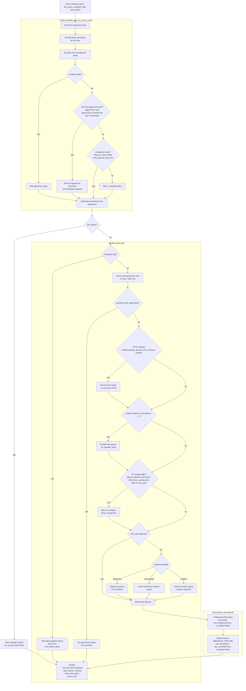

# Label Stream: Next Task Selection (LSE)

This doc summarizes how Label Studio Enterprise selects the next task for labeling, based on the current code in `label_studio/projects/functions/next_task.py` and LSE-specific logic from `label_studio_enterprise/lse_projects/functions.py`.

Notes
- Queue labels shown in the UI (e.g. "Ground truth queue", "Show overlap first") indicate which strategies were attempted, not always the final source of the selected task.
- Feature flags impact ordering and inclusion at several steps (see Legend below).

## High-level flow

## Legend and flags

- fflag FIX-BACK-LSDV-4523 (Overlap First Ordering): applies the "Show overlap first" filtering after GT/low-agreement/breadth-first attempts; otherwise, it is applied earlier while building the candidate pool.

### GT-first gating
- `should_attempt_ground_truth_first(user, project)` returns true when:
  - `show_ground_truth_first=True` and either no `lse_project` or `annotator_evaluation_minimum_tasks` is not set, or
  - the user's completed GT-equipped tasks < `annotator_evaluation_minimum_tasks`, or
  - minimum tasks reached but the user's GT agreement score is missing or below `annotator_evaluation_minimum_score` (percent).
- Otherwise returns false (GT-first disabled; proceed via low-agreement/overlap/sampling).

## Queue labels appended to response

The `queue_info` string aggregates labels as specific stages are attempted:
- "Manually assigned queue" when `assigned_flag` path is used.
- "Task lock" when returning a task already locked by the user.
- "Low agreement queue" when the prioritized low-agreement branch returns a task.
- "Ground truth queue" when GT is attempted (label may appear even if selection falls through).
- "Breadth first queue" for in-progress tasks (when `maximum_annotations > 1`).
- "Show overlap first" when overlap filtering is applied.
- Sampling labels:
  - "Sequence queue"
  - "Active learning or random queue" (uncertainty)
  - "Uniform random queue"
- Post queues:
  - "Postponed draft queue"
  - "Skipped queue"

## References
- Core selection: `label_studio/projects/functions/next_task.py`
- LSE agreement & counters: `label_studio_enterprise/lse_projects/functions.py`

